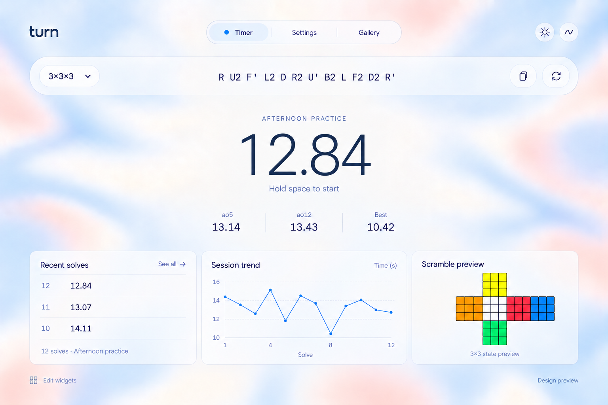

# Customizable speed-solving timer — implementation plan

Updated October 2, 2026. This document supersedes the earlier implementation plan and the proposed-product sections of the original feature brief. The selected mockup defines the default visual direction; sample data and decorative preview labels are illustrative, not functional requirements.

## Product and first release

Build a usable local-first 3×3 timer with the fixed approved desktop composition and a responsive stacked mobile layout. All widget editing, including positioning, resizing, alignment, grouping, visibility, and per-widget styles, is deferred at the user’s request on October 2, 2026. No account is required.

Include timing, inspection, penalties, sessions, recent solves, core averages, scramble preview, a session-trend graph, appearance editing, presets, and backup/import. Per-solve notes remain supported. Keep permanent navigation: Timer, Settings, Gallery. Gallery contains built-in and locally saved presets.

Defer the full Analytics page, distributions, advanced reporting, and community sharing. The basic session-trend widget is included in the first release.

Exclude Pretext and the dedicated recent-solves sidebar/expand-collapse behavior. Recent solves uses the fixed compact list shown in the approved design. Alternate widget sizes and styles are deferred.

## Visual direction — selected

Approved October 2, 2026: Refined Liquid with an open center. This is the sole visual reference embedded in the plan and supersedes the later glass-intensity and white-outline picker experiments.

Use a spacious, demo-inspired layout with regular-weight system typography, tabular timer digits, medium-weight labels, and flat text. Preserve the defined blue/peach gradient from Refined Liquid. The scramble bar is pill-shaped; bottom widgets use softer rounded rectangles.

The central timer and visible ao5/ao12/Best values sit directly on the background, with no enclosing fill, blur, shadow, or outline. Keep subtle separators between statistics. Users may hide statistics through customization.

Keep permanent Timer / Settings / Gallery navigation. Match the selected image: a faint outer outline with a pale-blue selected capsule and blue dot for the active Timer tab. Maintain a legible selected state in both themes and a distinct keyboard-focus indicator.

Default lower row: recent solves on the left, a wider session-trend graph in the middle, and scramble preview on the right. No Session notes card. Keep surfaces readable through controlled opacity and local frost, with faint edges. Background softness and card blur are independent.

The default material is the selected image’s restrained, flat frosted surface with faint outlines and minimal depth. Avoid luminous glass rims, inflated edges, heavy outlines, 3D text, aggressive refraction, and bouncy transitions. Tint, opacity, and blur remain customizable. Other exploratory mockups stay outside this plan.

## Appearance and motion

Provide an Appearance panel with live preview and three built-in presets: Liquid Studio, Editorial, Precision. The selected Refined Liquid design defines the default Liquid Studio preset, including its restrained frost and open center. Users can save named presets, duplicate them, and reset changes.

- Global controls: palette, text/accent colors, font family and scale, card tint and opacity, glass intensity, backdrop blur (independent from background softness), outline color/thickness, corner radius, and shadow.
- Deferred widget overrides: surface, outline, radius, typography, and content-specific options. Unset properties inherit global values; a reset action restores inheritance.
- Timer controls: digit font, weight, size or auto-fit, displayed precision, and visible inline statistics.
- Background controls: solid color or WebGL gradient, palette, cursor distortion strength, and motion intensity. Use a real WebGL shader with smooth local displacement of a soft color field; no dots, literal water ripples, or aggressive liquid folds. Fall back to a static gradient if WebGL fails or its context is lost.
- Light and dark modes are supported by every built-in preset. Preserve separate theme color values when switching modes.
- Pause background animation during solves and when the page is hidden. Respect reduced motion and a user motion-off setting. Use restrained eased fades and transitions without bouncy springs. Direct manipulation follows the pointer without easing lag.

## Architecture and behavior

### Stack and module boundaries

Use Bun for dependency management and package scripts, with a pinned Bun version and frozen lockfile in CI. Retain Node for tool compatibility. Use React, TypeScript, Vite, CSS Modules/variables/container queries, Motion for React, Interact.js, Zustand, Dexie/IndexedDB, Zod, and cubing.js. Background rendering uses WebGL; there is no Canvas 2D animation or Pretext dependency. Browser text wrapping and fluid sizing handle responsive typography.

Keep timer/statistics logic, persistence, layout geometry, widget renderers, appearance, and background effects separate. Interact.js provides gesture input; our layout module owns constraints, snapping, collision checks, and placement.

A widget definition declares renderer, settings, default size, and minimum dimensions. Widget instances have stable IDs, type, settings, and layout/group membership. Versioned workspace configurations store desktop geometry, mobile order, groups, anchors, global appearance, and overrides. Store solve/session data separately. First release permits one instance per widget type; the data model allows future duplication.

### Timing and records

Support keyboard, touch, and manual entry. Use an independent state machine and monotonic elapsed-time clock; rendering must never determine solve duration. Default inspection off and hold-to-start at 300 ms. Support 15-second inspection, +2 at 15 seconds, and DNF at 17 seconds; test exact boundaries. With inspection enabled, first activation begins inspection, then hold/release starts timing.

Ignore shortcuts while editing text, in dialogs, and in layout-edit mode. Ignore repeated key events and prevent the touch release after stopping from starting another solve. Preserve explicit editable penalties. Record duration, penalty, scramble, timestamp, session, and optional notes. Include sessions, solve editing, and deletion with undo; confirm session deletion.

Pre-generate scrambles, retain the current one until a replacement is ready, and expose retry on failure. Generate the static puzzle preview from the actual scramble. Core statistics are count, best, mean, mo3, ao5, ao12, and ao100; apply penalties before calculation and test trimming and DNF handling. Detailed analytics are postponed.

### Session-trend widget

Replace the Session notes card with a graph of the current session’s solve times. Use solve order on the horizontal axis and seconds on the vertical axis, a thin muted-blue line, small points, faint gridlines, and compact labels. Apply +2 penalties to plotted durations; mark DNF attempts without treating them as zero or connecting a misleading line through them. Provide empty and single-solve states, accessible textual values, and adapt tick density to widget size. Editing or deleting solves updates the chart. Keep chart work independent from the deferred full Analytics page.

### Future phase — widget editor (deferred)

Explicit Edit layout mode supports free placement, edge/corner resizing, multi-selection, alignment, equal spacing, hide/restore, grouping, and undo/redo. Include numeric geometry controls for keyboard access. Optional 8 px snapping and edge/center guides assist placement.

Prevent overlaps and out-of-bounds placements. Show invalid-placement feedback and retain the last valid geometry without pushing neighbors or closing intentional gaps. Alignment and distribution operations must also respect these constraints.

Support one group level: free arrangement, row, or column. Groups move together. Free groups preserve internal positions; their frames cannot shrink to clip children. Row/column groups provide adjustable gaps and fixed-or-fill child sizing. Never stretch text or controls when resizing a group. Provide horizontal left/center/right anchoring to preserve intentional alignment as the workspace changes width.

Widgets adapt to dimensions: timer text auto-fits within limits, scrambles wrap, tables omit optional columns or scroll. Persist completed editor actions, not every pointer event. If viewport changes invalidate desktop placement, show the mobile stack without overwriting desktop geometry.

Below 768 px, use a separate single-column mobile layout with reorder, visibility, style, and height presets. Preserve touch timing; defer free-placement mobile editing.

### Local data and offline use

Save solves immediately; show storage failures visibly. Persist settings and layouts with schema versions and migrations. Include native JSON backup/restore, CSV solve export, and standard csTimer JSON session import for times, penalties, scrambles, timestamps, and comments. Use shared Zod schemas at backup/import and saved-settings boundaries. Validate records individually so invalid rows can be previewed without discarding valid solves; default missing version-one appearance fields and reject unsupported versions. Preview invalid/unsupported import records before committing.

Cache the app for offline use after first successful loading. Apply updates between solves. Defer accounts, sync, community publishing, hardware input, more puzzle events, advanced training, nested groups, overlapping layers, and arbitrary CSS.

## Delivery and validation

Build in increments: timer/data foundation; default workspace with WebGL and themes; appearance controls; presets, imports, offline behavior, and polish. Defer the layout editor and its acceptance checks to a later phase. Include the basic session-trend widget with the default workspace; the dedicated Analytics page and advanced reporting remain deferred.

Use Vitest for timing, statistics, migrations, imports, and pure geometry. Use Playwright for solve flows, appearance changes, persistence, and responsive behavior.

Acceptance checks:

- Session-trend values match stored solves and penalties, handle DNF/empty/single-solve states, and stay legible at supported widget sizes.
- Timing stays correct under rendering load; inspection boundaries, repeated keys, touch gestures, penalties, and DNF averages behave consistently.
- Future layout-editor phase: drag/resize, collisions, alignment, groups, anchors, and undo/redo preserve user intent.
- Global styles survive reload, reset predictably, and work in light/dark mode. Per-widget overrides are deferred.
- Mobile transitions never alter saved desktop layouts.
- Backup round trips, csTimer imports, offline reloads, and storage failures are exercised.
- WebGL context loss uses the static fallback; motion pauses during solves and honors accessibility preferences.
- Test Chrome, Safari, and Firefox plus representative mobile hardware. Profile resizing with background effects enabled.
- Verify the selected reference’s pale-blue active picker, borderless central timer/statistics, restrained frosted surfaces, and light/dark contrast. Preserve faint edges and flat typography across glass levels.
